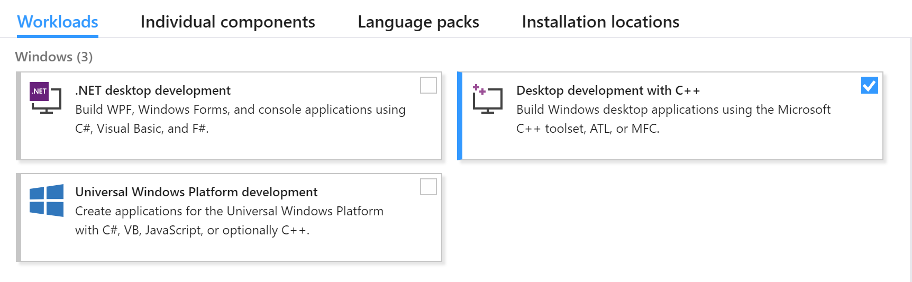
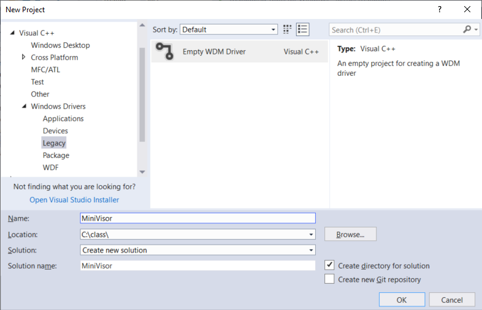
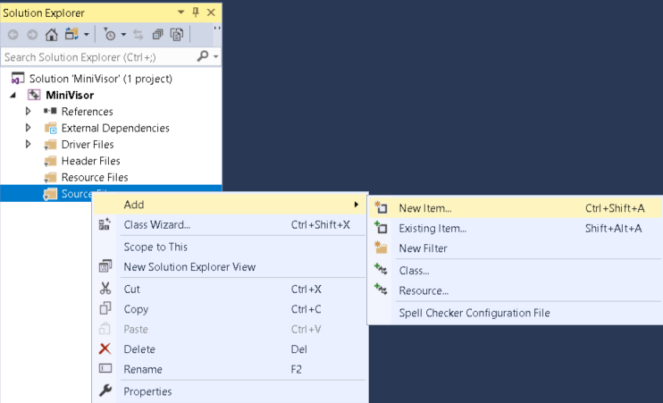
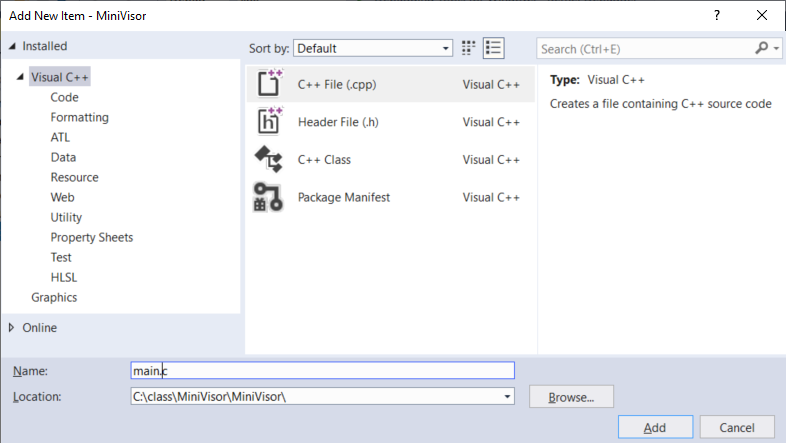

# Environment Setup

This chapter describes the steps to setup the driver development and debug environment.

## Hardware prerequisites

The course discusses hypervisor development on the Intel platform so you will need an Intel CPU supporting the virtualization extensions (VT-x) and nested page tables (EPT).  Practically speaking, any CPU in the last 5 years will work.

Your PC should be running Windows 10 x64. NOT Mac or Linux as a host.

## Software prerequisites

Windows driver development require the following software packages:

1. Visual Studio: the main IDE.  The current version is _Visual Studio 2017_. We will be using the free "Community" edition, but any other edition will work as well. Download it from [here](https://visualstudio.microsoft.com/downloads/).
2. Windows Software Development Kit (SDK): a set of headers, libraries, tools, and debuggers to development user-mode code. The current version is _SDK for Windows 10, version 1809_. Download it from [here](https://developer.microsoft.com/en-us/windows/downloads/windows-10-sdk).
3. Windows Driver Kit (WDK): Same as the SDK except that it is used for the development of kernel-mode code. The current version is _WDK for Windows 10, version 1809_. Download it from [here](https://docs.microsoft.com/en-us/windows-hardware/drivers/download-the-wdk).

You _must_ install the software in the order listed above, otherwise things may not work for mysterious reasons. By default, the Visual Studio installation does not include support for C/C++ development.  You must check the _Desktop development with C++_ workload as shown in the diagram below.

In addition to them,

4. VMware Workstation 15: The virtualization software. We will develop the hypervisor inside VMWare so you will also need to install this. Download it from [here](https://www.vmware.com/products/workstation-pro/workstation-pro-evaluation.html). 30 days free trial is available.
    * NOT any other virtualization software as they do not support nested virtualization we are going to rely on.
5. Windows 10 (x64) VM. We will use Windows 10 as a target environment. No strict requirements on the build version. Download the media creation tool from [here](https://www.microsoft.com/en-ca/software-download/windows10) and create an ISO file to install it in VMware.

The virtual machine should have 2GB of memory, 2 cores, and `Virtualize Intel VT-x/EPT or AMD-V/RVT` should be checked.

Finally, its network adapter should be set to "Host-only". This allows certain debugging configurations while preventing Windows Update from running.

## Debuggers

The debuggers are installed as part of the SDK/WDK package. By default, the 64-bit debugger is in:

~~~
C:\Program Files (x86)\Windows Kits\10\Debuggers\x64
~~~

You do not want to type such a long path all the time so add it to your `PATH` environment variable.

### Setting up kernel debugging

See [Setting up kernel debugging (VirtualKD)](VirtualKD.md).

### Windbg Preview (Optional)

You are free to use Windbg Preview. Any of instructions in this class should be applicable for it. Execute `windbgx` instead of `windbg` or `kd`.

## Test Development

To create a driver, we first create a new Visual Studio project:

1. Click _File, New, Project_. Select _Templates, Visual C++, Windows Driver, Legacy, Empty WDM Driver._

2. Name the project `MiniVisor`, specify `C:\class\` as a location, and click _OK_.

3. Add a source file. Right click on _Source Files_, _Add_, _New Item_.

4. Add a new file call `main.c` (NOT `.cpp`).

5. Change the default build architecture to _x64_.

6. Type in the following source code:

~~~
#include <ntifs.h>

NTSTATUS DriverEntry(PDRIVER_OBJECT drvObj, PUNICODE_STRING regPath)
{
    DbgPrintEx(DPFLTR_IHVDRIVER_ID, DPFLTR_ERROR_LEVEL, "drvObj %p regPath %wZ\n", drvObj, regPath);
    __debugbreak();
    return STATUS_UNSUCCESSFUL;
}
~~~

7. Build the driver by clicking _Build_, _Build solution_.  Alternatively, you can use the shortcut `Ctrl + Shift + B`.

### Deploying the driver

We will be using `.kdfiles` to deploy the driver to the target machine.

1. On the target, create a service called `MiniVisor`. Don't start it yet.  This can be done from the command line (make sure the directory exists):

~~~
C:\>sc create MiniVisor type= kernel binPath= c:\dev\MiniVisor.sys
~~~

1. Create a text file called `drv.map` and put it in a convenient directory like `c:\class` on the host.  Put this for the content of the file:

~~~
map
\??\C:\dev\MiniVisor.sys
C:\class\MiniVisor\x64\Debug\MiniVisor.sys
~~~

2. Break into the kernel debugger and type:

~~~
kd> .kdfiles c:\class\drv.map
KD file associations loaded from 'c:\class\drv.map'
~~~

Then press `g` to let the target run again.

3. Switch to the target and start the service we just created.

~~~
C:\>sc start MiniVisor
~~~

At this point, the file should be automatically copied over and loaded into the kernel. It should also automatically break into the debugger.

~~~
KDFILES: Replacing '\??\c:\dev\MiniVisor.sys' with 'C:\class\MiniVisor\x64\Debug\MiniVisor.sys'.  File size 7KB.
KdPullRemoteFile(FFFFD9048934D040): About to overwrite \??\c:\dev\MiniVisor.sys and preallocate to 1868
KdPullRemoteFile(FFFFD9048934D040): Return from ZwCreateFile with status 0
.....
Driver Verifier: Enabled for MiniVisor.sys, flags 0x209bb, build 17134, key 6K64un4JI0UUpD0eX04o7E
drvObj FFFFD9048D943310 regPath \REGISTRY\MACHINE\SYSTEM\ControlSet001\Services\MiniVisor
Break instruction exception - code 80000003 (first chance)
MiniVisor!DriverEntry+0x31:
fffff802`4b8a1031 cc              int     3
~~~

Press `g` and the let target continue. The `sc` command is expected to fail since the DriverEntry returns the error code. Ignore the error.

~~~
[SC] StartService FAILED 31:

A device attached to the system is not functioning.
~~~

## Before moving on

Make sure:

1. You have a working kernel debugging environment.
2. You can compile and deploy your driver with ease.
3. You can print and see debug messages in the kernel debugger.
4. Once you have everything setup and working, snapshot the VM.
